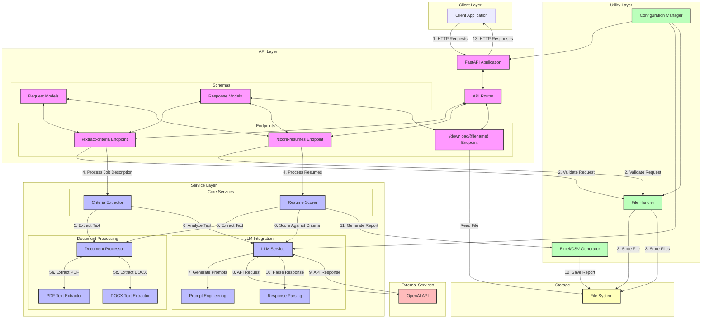
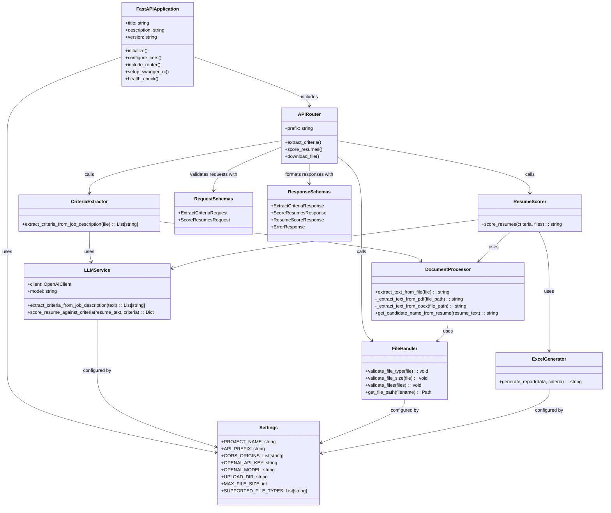

# Resume Ranking API

A production-ready FastAPI application that automates the process of ranking resumes based on job descriptions.

## Features

- Extract key ranking criteria from job descriptions (PDF/DOCX formats)
- Score multiple resumes against extracted criteria
- Generate Excel/CSV reports with candidate rankings
- Well-documented API with Swagger UI
- Docker support for easy deployment

## System Architecture

The application consists of the following components:

1. **API Layer**: FastAPI endpoints for receiving requests and returning responses
2. **Service Layer**: Core business logic for text extraction, criteria identification, and resume scoring
3. **LLM Integration**: Uses OpenAI APIs to analyze text and provide intelligent scoring
4. **Utility Layer**: Helpers for file handling, validation, and report generation

### Low Level Diagram



### Sequence Diagram
```
sequenceDiagram
    participant Client
    participant API as FastAPI (API Layer)
    participant File as FileHandler
    participant DocProcessor as DocumentProcessor
    participant Criteria as CriteriaExtractor
    participant LLM as LLMService
    participant OpenAI
    participant Scorer as ResumeScorer
    participant Excel as ExcelGenerator
    participant Storage as FileSystem

    %% Extract Criteria Flow
    Note over Client,Storage: Extract Criteria from Job Description Flow
    
    Client->>+API: POST /extract-criteria (Job Description File)
    API->>+File: Validate File
    File-->>-API: Validation Result
    
    API->>+File: Save File Temporarily
    File->>Storage: Write File
    File-->>-API: Temporary File Path
    
    API->>+Criteria: Extract Criteria from Job Description
    Criteria->>+DocProcessor: Extract Text from File
    DocProcessor->>Storage: Read File
    DocProcessor-->>-Criteria: Extracted Text
    
    Criteria->>+LLM: Analyze Text for Criteria
    LLM->>LLM: Generate Prompt
    LLM->>+OpenAI: API Request
    OpenAI-->>-LLM: Criteria JSON Response
    LLM->>LLM: Parse Response
    LLM-->>-Criteria: Extracted Criteria
    
    Criteria-->>-API: List of Criteria
    API->>API: Format Response
    API-->>-Client: Criteria JSON Response
    
    %% Score Resumes Flow
    Note over Client,Storage: Score Resumes Against Criteria Flow
    
    Client->>+API: POST /score-resumes (Criteria & Resume Files)
    API->>+File: Validate Files
    File-->>-API: Validation Result
    
    API->>+File: Save Files Temporarily
    File->>Storage: Write Files
    File-->>-API: Temporary File Paths
    
    API->>+Scorer: Score Resumes Against Criteria
    
    loop For Each Resume
        Scorer->>+DocProcessor: Extract Text from Resume
        DocProcessor->>Storage: Read File
        DocProcessor-->>-Scorer: Extracted Text
        
        Scorer->>DocProcessor: Get Candidate Name
        DocProcessor-->>Scorer: Candidate Name
        
        Scorer->>+LLM: Score Resume Against Criteria
        LLM->>LLM: Generate Scoring Prompt
        LLM->>+OpenAI: API Request
        OpenAI-->>-LLM: Scores JSON Response
        LLM->>LLM: Parse Response
        LLM-->>-Scorer: Scores for Each Criterion
    end
    
    Scorer->>+Excel: Generate Report
    Excel->>Excel: Create Spreadsheet
    Excel->>Storage: Save Report File
    Excel-->>-Scorer: Report File Path
    
    Scorer-->>-API: Report File Path
    API->>API: Generate Download URL
    API-->>-Client: Download URL Response
    
    %% Download Report Flow
    Note over Client,Storage: Download Report Flow
    
    Client->>+API: GET /download/{filename}
    API->>+Storage: Check If File Exists
    Storage-->>-API: File Existence Status
    
    alt File Exists
        API->>Storage: Read File
        Storage-->>API: File Content
        API-->>Client: File Download Response
    else File Not Found
        API-->>Client: 404 Not Found Error
    end
```

### Component Diagram


## API Endpoints

### 1. Extract Criteria from Job Description

```
POST /api/v1/extract-criteria
```

Extracts key ranking criteria from a job description file (PDF or DOCX).

**Input**: Multipart form with a job description file
**Output**: JSON list of ranking criteria

### 2. Score Resumes Against Criteria

```
POST /api/v1/score-resumes
```

Scores multiple resumes against provided criteria and generates a report.

**Input**: Multipart form with criteria list and resume files
**Output**: URL to download the generated Excel/CSV report

### 3. Download Report

```
GET /api/v1/download/{filename}
```

Downloads a generated report file.

## Setup Instructions

### Prerequisites

- Python 3.10+
- OpenAI API key
- Docker and Docker Compose (optional)

### Environment Setup

1. Clone the repository:
   ```bash
   git clone https://github.com/yourusername/resume-ranking-api.git
   cd resume-ranking-api
   ```

2. Create a virtual environment and install dependencies:
   ```bash
   python -m venv venv
   source venv/bin/activate  # On Windows: venv\Scripts\activate
   pip install -r requirements.txt
   ```

3. Create a `.env` file from the template:
   ```bash
   cp .env.example .env
   ```
   
4. Update the `.env` file with your OpenAI API key and other settings.

### Running the Application

#### With Python (Development)

```bash
uvicorn app.main:app --reload
```

The API will be available at http://localhost:8000, and the Swagger UI at http://localhost:8000/docs.

#### With Docker (Recommended for Production)

```bash
docker-compose up -d
```

The API will be available at http://localhost:8000, and the Swagger UI at http://localhost:8000/docs.

## Usage Examples

### Extract Criteria from Job Description

```bash
curl -X POST "http://localhost:8000/api/v1/extract-criteria" \
  -H "accept: application/json" \
  -H "Content-Type: multipart/form-data" \
  -F "file=@job_description.pdf"
```

### Score Resumes Against Criteria

```bash
curl -X POST "http://localhost:8000/api/v1/score-resumes" \
  -H "accept: application/json" \
  -H "Content-Type: multipart/form-data" \
  -F "criteria=Must have certification XYZ" \
  -F "criteria=5+ years of experience in Python development" \
  -F "criteria=Strong background in Machine Learning" \
  -F "files=@resume1.pdf" \
  -F "files=@resume2.docx"
```

## Contribution Guidelines

1. Fork the repository
2. Create a feature branch: `git checkout -b feature-name`
3. Implement your changes and write tests
4. Run tests and ensure they pass
5. Submit a pull request


